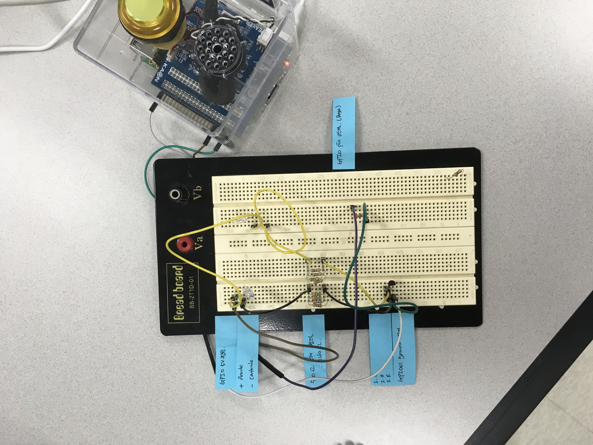

# 인공지능 리모컨 만들기 (2018.07. ~ 2018.08 두달)

## 준비물

- 내맘대로 AI 스피커 (메이커스에서 출시, 라즈베리 포함 세트)
- Bread board, 트랜지스터, Infra red 센서(적외선 센서), 저항등 필요

## 수행한 일

- Bread board와 저항, 트랜지스터를 활용하여 Amplifier 제작
  

- 라즈베리파이에 코드 작성

## 기능

- 인공지능 리모컨 시연영상

  

- **음성으로 TV on/off 제어**
- **음성으로 에어컨 on/off 제어**

